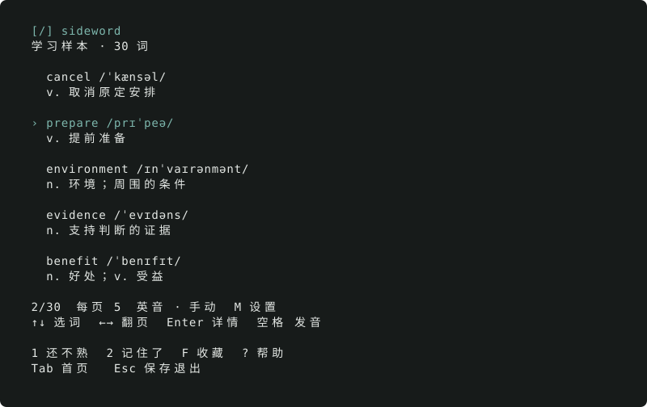

<picture>
  <source media="(prefers-color-scheme: dark)" srcset="docs/assets/wordmark-dark.svg">
  
</picture>

给单词留一点空间。在终端里，慢慢把英语学起来。

[English](README.md) · [使用指南](docs/guide.md) · [导入词库](docs/word-books.md) · [参与开发](CONTRIBUTING.md)



看几个词，听一个词，到时间再回来复习。

Sideword 把单词、音标、中文释义和双语例句放进终端。记住的词从日常列表中退场，
到期再出现；没学完的部分，下次接着来。不需要账号、服务器，也不上传学习记录。

## 开始学习

**Mac 一条命令安装**（Apple Silicon，macOS 14+；无需 Python / uv）：

```sh
curl --proto '=https' --tlsv1.2 -fsSL https://github.com/shanezchang/sideword/releases/download/v0.4.0-beta.1/install.sh | /bin/bash
```

新开终端输入 `sideword`，或直接运行 `~/.local/bin/sideword`。
也可以[下载 ZIP](https://github.com/shanezchang/sideword/releases/tag/v0.4.0-beta.1)，
解压后双击 `Install.command`。

这是**未公证预览版**，macOS 可能要求单独批准打开；不要关闭系统安全保护。
[安装位置、升级、卸载与安全提示](docs/install-macos.md)。

### 从源码运行 / Linux / 开发者

先安装 [uv](https://docs.astral.sh/uv/getting-started/installation/)，然后：

```sh
git clone https://github.com/shanezchang/sideword.git
cd sideword
uv run sideword
```

Python 和虚拟环境由 uv 管理。默认 Python 3.14，支持 3.12+。
macOS / Linux 可用，目前发音仅支持 macOS 系统语音。

如果希望在任意目录直接启动：

```sh
uv tool install --python 3.14 git+https://github.com/shanezchang/sideword.git
sideword --page-size 10
```

目前未发布 PyPI，以上命令直接从这个仓库安装。

## 先认识，再记住

- **按自己的节奏看。** 每页词数随意设置，选中词可展开完整释义和例句。
- **一次听一个。** 默认英音自动播放，切词停止上一段，也可以随时静音。
- **记住不等于结束。** 日常学习隐藏熟词，到期复习先回忆，再揭晓答案。
- **离开也没关系。** 随机顺序、阅读位置、偏好和进度都会留在本地。

`↑↓` 选词 · `←→` 翻页 · `Enter` 详情 · `空格` 发音<br>
`1 / 2` 不熟 / 记住 · `M` 每页词数 · `R` 复习 · `?` 帮助

想安静地打开，用 `sideword --quiet`。详细按键和复习机制见[使用指南](docs/guide.md)。

## 使用自己的词库

公开版附 **30 词原创示例**，不冒充完整雅思课程。将兼容的 JSON 词库放入
`~/.local/share/sideword/books/`，运行 `sideword --list-books` 即可发现。
[查看格式与内容授权说明](docs/word-books.md)。

学习记录保存在同目录的 SQLite 数据库里。更新软件不会覆盖记录；
也支持 `--data-dir` 和 `XDG_DATA_HOME` 自定义路径。

## 简单，也认真

Python + curses + SQLite，运行时没有第三方依赖。uv 管环境、锁定依赖和构建；
代码按词库、复习规则、存储、发音、界面划分。[项目结构](docs/architecture.md) ·
[贡献指南](CONTRIBUTING.md)。

独立代码和原创示例使用 MIT 许可证；导入内容保留原有授权。
Sideword 与雅思官方或商业背词产品无隶属关系。
